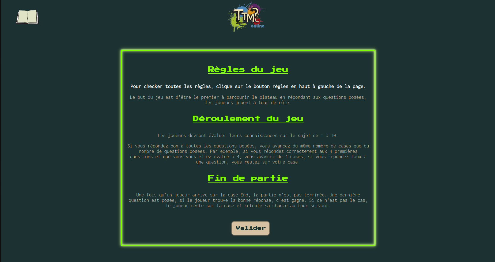
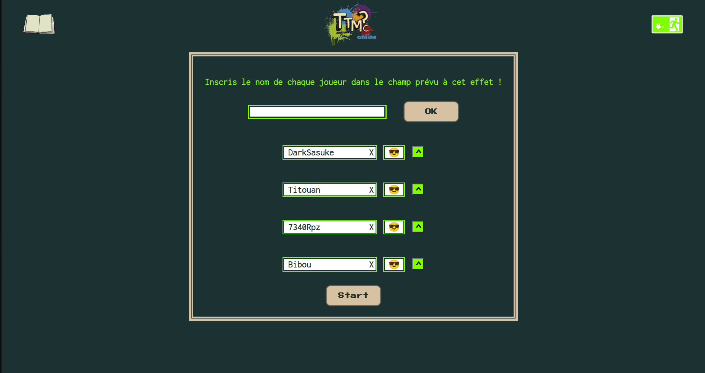
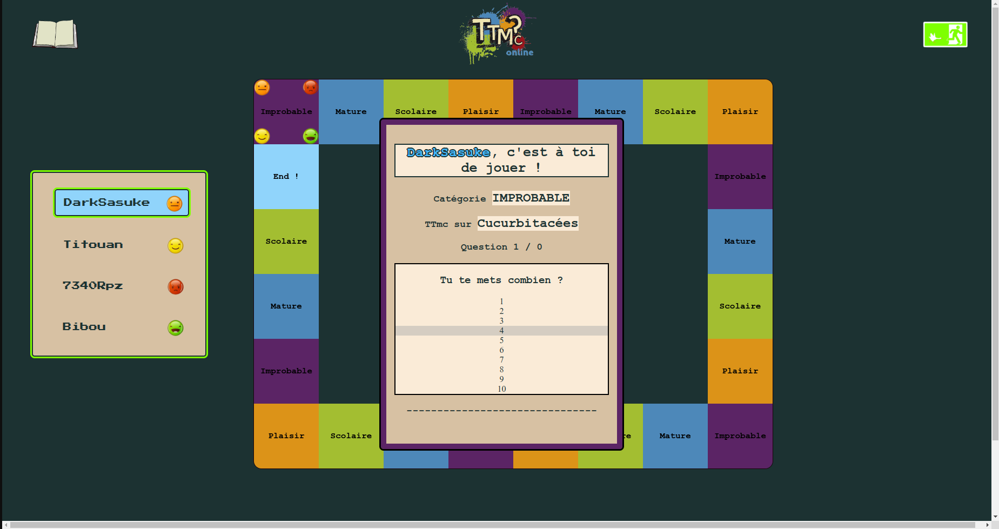
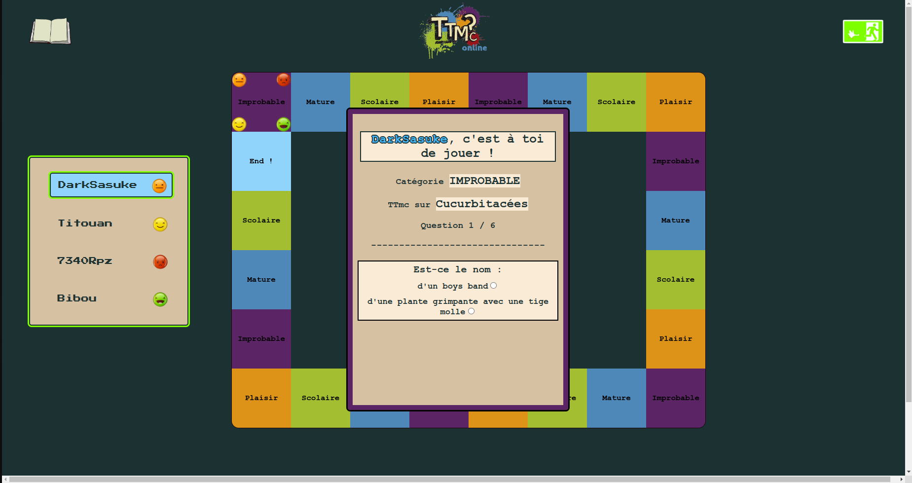

# TTMC

TTMC is a group project carried out as part of the finalization of the Front-End Developer training at Technocité Hornu.

## Description

TTMC is a board game similar to Trivial Pursuit with a few differences. We used React as the main technology for the project, along with Canvas for the game board. Due to time constraints and the focus on specific skills during the project, we didn't have the opportunity to address certain details, such as responsiveness and some functionality corrections. However, we achieved the set objectives, and the program is mostly functional. As a requirement for the project, we needed to use an API, but since there was no specific API available for the game, we decided to create our own database and make a request to a local server to retrieve the data.

## Installation

1. Clone this repository to your local machine.
2. Make sure you have [Node.js](https://nodejs.org) installed.
3. Make sure you have [nodemon](https://www.npmjs.com/package/nodemon) installed.
4. Open two terminal windows and navigate to the project directory.
5. In the first terminal, navigate to the [server] folder and run the command `nodemon server.js`.
6. In the second terminal, navigate to the [ttmc] folder and run the command `npm i` to install the dependencies.
7. In the second terminal, still in the [ttmc] folder, run the command `npm run dev` to start the application.

## Project Structure

projet
├── server
├── front
│ ├── public
│ └── src
│ ├── components
│ │ └── cards
│ ├── config
│ ├── functions
│ ├── style
│ ├── App.jsx
│ └── main.jsx
├── .gitignore
├── index.html
└── package.json

## Features

- **Feature 1:** Initially, players will need to register and choose a game piece to represent them.
- **Feature 2:** Players will have the option to wager the number of answers they can provide.
- **Feature 3:** Players will have to answer the questions using text inputs or radio inputs.
- **Feature 4:** When a player answers all questions correctly, their game piece advances accordingly.

## Screenshots

## Authors

- Célestine - UI/UX Designer
- Christophe Buffe (www.linkedin.com/in/christophe-buffe) - Lead Developer
- Sandrine - Front-End Developer
- Veasna - Front-End Developer